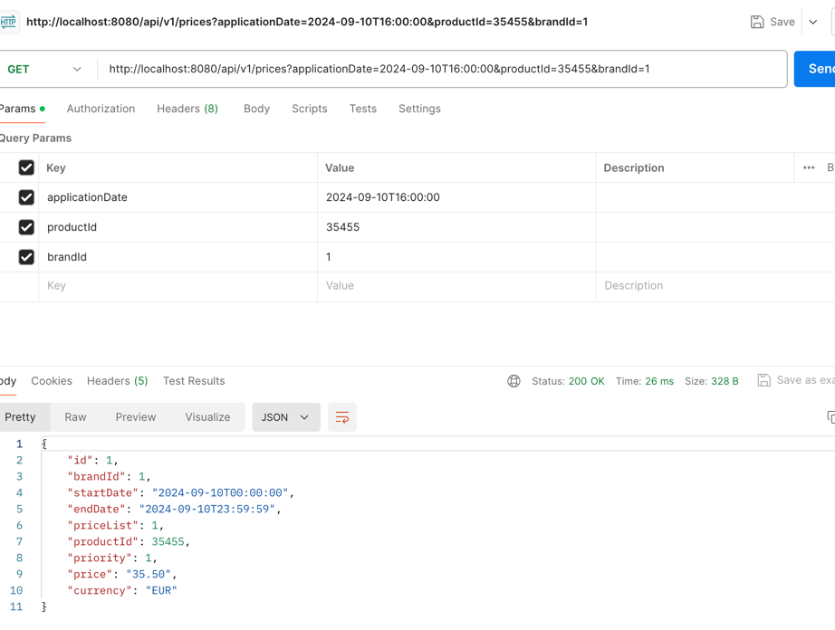

# Price Service Application

## Overview
This application provides pricing information based on product ID and brand ID.

## Running the Application
1. Clone the repository.
2. Navigate to the project directory.
3. Run the application using:
   ```bash
   ./gradlew bootRun

## API call & CURL example with success:

curl -X GET "http://localhost:8080/api/v1/prices?applicationDate=2024-09-10T16:00:00&productId=35455&brandId=1" -H "
Accept: application/json"



## Testing
To run the tests, use:
./gradlew test
to run E2E test be sure u started the app first.

## Code Specifications
Java 17
Spring Boot 3.3.3
JUnit 5 for testing

## To access the health check endpoint at:
http://localhost:8080/actuator/health
